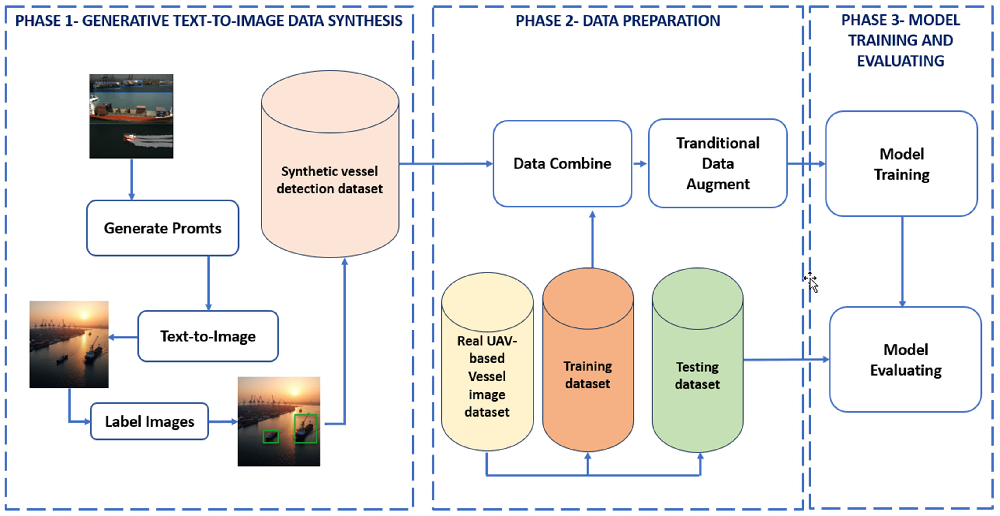

# UAVVesselDiffusion
This repository is a diffusion-based framework for synthetic UAV vessel image generation and data augmentation for vessel detection tasks, official implementation of the paper "CRF-EfficientUNet: an improved UNet framework for polyp segmentation in colonoscopy images with combined asymmetric loss function and CRF-RNN layer"

 
**The proposed pipeline for UAV-based vessel detection dataset augmentation**

**Synthetic image generator using multimodal language and diffusion models**

**Synthetic dataset generation for rare object classes**

# Prerequisites
1. Linux or OSX
2. NVIDIA GPU + CUDA CuDNN (CPU mode and CUDA without CuDNN may work with minimal modification, but untested)
3. Python3.10
4. Opencv-python==4.3.0
5. torch==2.7.0, torchvision==0.22.05
6. Diffusers==0.35.1
7. transformers=4.49.0
8. Utraltic

# Datasets
The images and labels of the two synthetic vessel detection datasets, **ADPSynImg** and **FluxSyn**, generated using our proposed data synthesis methods, can be downloaded here 

Download link:
  - https://drive.google.com/drive/folders/1UDGWlorV5UbZfCXyTGVaxyejJMfA378x?usp=sharing

# Email
Any questions, you can contact: hongltt@ioit.ai.vn;
