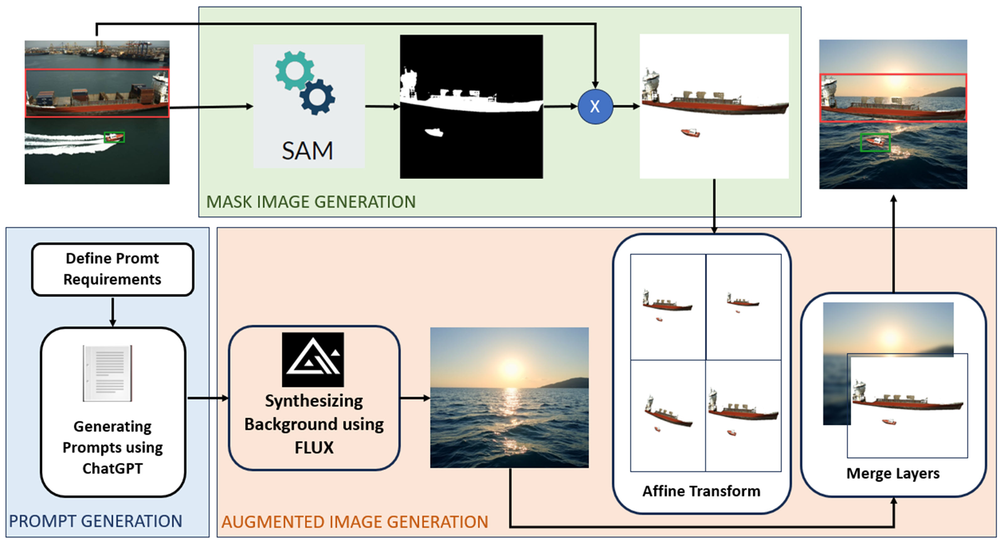

# UAVVesselDiffusion
This repository is a diffusion-based framework for synthetic UAV vessel image generation and data augmentation for vessel detection tasks.



# Prerequisites
1. Linux or OSX
2. NVIDIA GPU + CUDA CuDNN (CPU mode and CUDA without CuDNN may work with minimal modification, but untested)

4. tensorflow==1.13.1
5. numpy==1.18.5
6. Keras==2.2.4
7. opencv-python==4.3.0

## Cite
If you find our work useful in your research or publication, please cite our work:
```
@article{thanh2021crf,
  title={CRF-EfficientUNet: An Improved UNet Framework for Polyp Segmentation in Colonoscopy Images With Combined Asymmetric Loss Function and CRF-RNN Layer},
  author={Thanh, Nguyen Chi and Long, Tran Quoc and Hong, Le Thi Thu},
  journal={IEEE Access},
  volume={9},
  pages={156987--157001},
  year={2021},
  publisher={IEEE}
}
